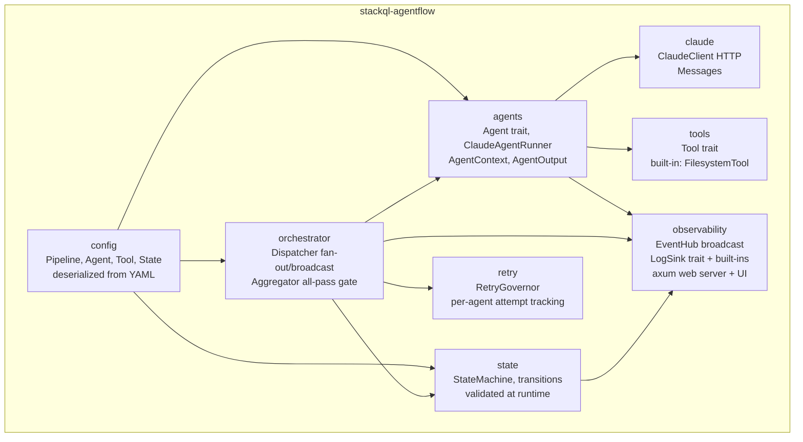
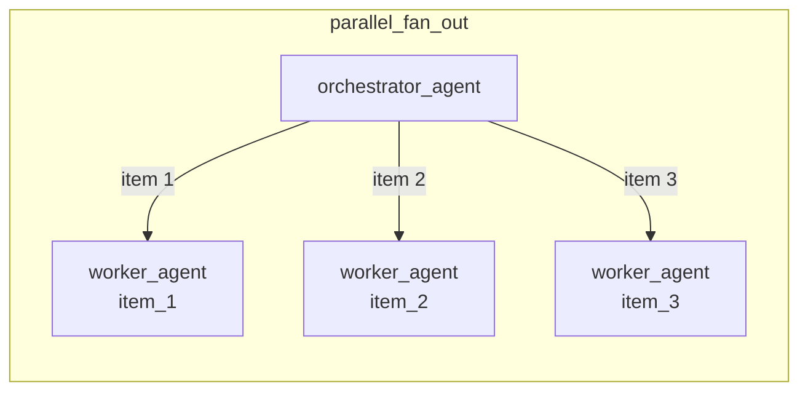
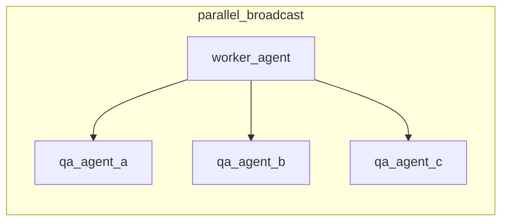
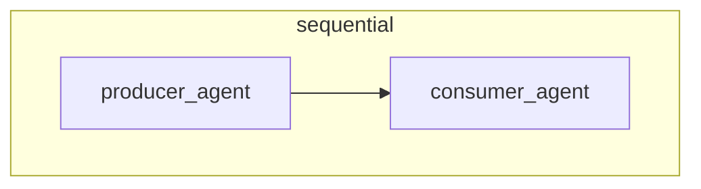
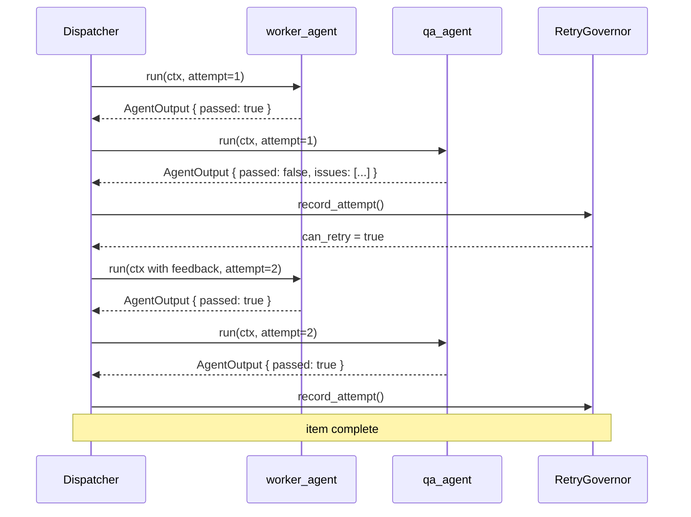
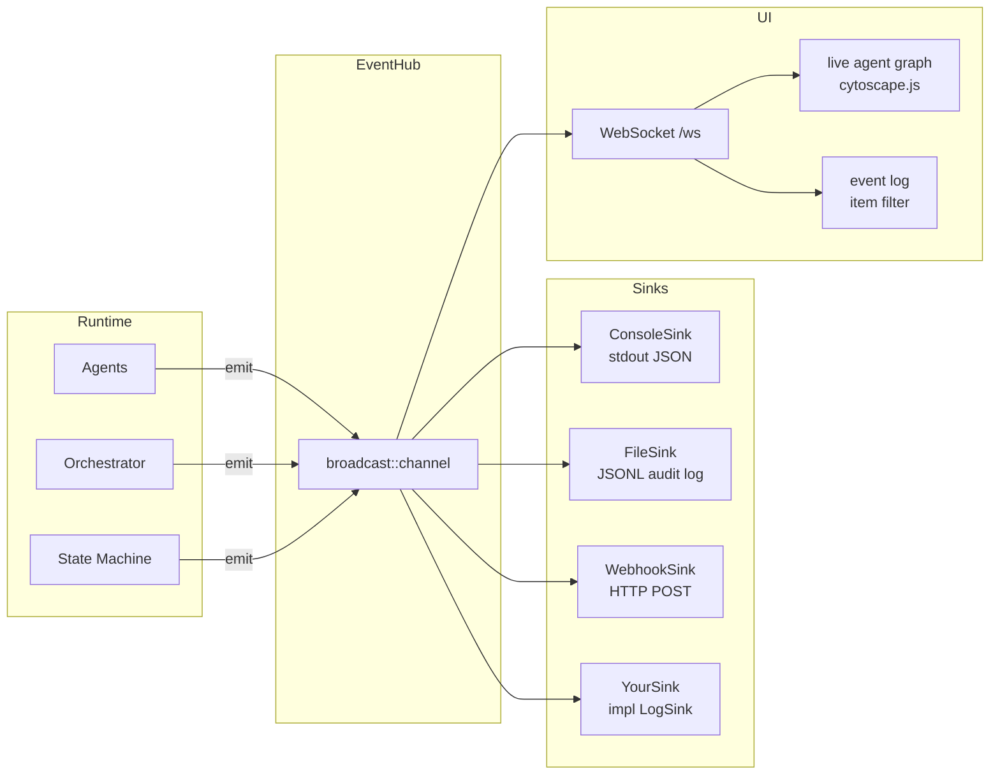

# stackql-agentflow

A lightweight, opinionated multi-agent orchestration framework written in Rust.
Pipelines are defined in YAML. Agents are powered by Claude. State machines are
explicit and type-safe. Observability is built in.

> Built by [StackQL Studios](https://github.com/stackql-labs) as the engine
> behind internal AI automation tooling. Designed to be embeddable as a library
> in any Rust application that needs structured, auditable, multi-agent workflows.

---

## Table of Contents

- [Goals](#goals)
- [What it is not](#what-it-is-not)
- [Architecture overview](#architecture-overview)
  - [Core modules](#core-modules)
  - [Pipeline lifecycle](#pipeline-lifecycle)
  - [Dispatch strategies](#dispatch-strategies)
  - [QA feedback loop](#qa-feedback-loop)
  - [Observability pipeline](#observability-pipeline)
- [The YAML DSL](#the-yaml-dsl)
- [Hello world](#hello-world)
  - [Prerequisites](#prerequisites)
  - [Run the demo](#run-the-demo)
  - [What you will see](#what-you-will-see)
- [Extending the framework](#extending-the-framework)
  - [Plugin tools](#plugin-tools)
  - [Log sinks](#log-sinks)
- [Project structure](#project-structure)
- [Roadmap](#roadmap)

---

## Goals

**Correctness over convenience.** State transitions are explicit Rust types. An
invalid transition is a compile-time or runtime error, not a silent bug buried
in a callback chain.

**Pipelines as config, behaviour as code.** The shape of a pipeline - which
agents run, in what order, with what retry policy, dispatching to what
downstream agents - lives in a YAML file. The things that make your pipeline
unique (custom tools, external integrations) live in Rust code that you own.

**Built-in observability.** Every pipeline run emits structured events to a
broadcast hub. A local web UI with a live agent graph starts automatically. Log
sinks (file, console, webhook) are first-class citizens, not an afterthought.

**No spaghetti.** The Rust ecosystem does not need another Python wrapper around
LLM APIs. stackql-agentflow is a Rust-native library with no dependency on
LangChain, LangGraph, or any other orchestration framework.

**Parallel by default where it makes sense.** Fan-out dispatch (one upstream
result spawning N parallel downstream agents) and broadcast dispatch (one result
sent to N different agents in parallel) are built into the dispatcher using
`tokio::task::JoinSet`.

**Auditable.** Every agent invocation, state transition, tool call, QA feedback
loop, and retry is recorded as a structured `PipelineEvent`. Events are
serialisable to JSONL for long-term audit retention.

---

## What it is not

- A Python library
- A general-purpose LLM API client
- A replacement for task queues or workflow engines like Temporal for long-running jobs
- Production-ready v1 software - this is an active early-stage project

---

## Architecture overview

### Core modules



### Pipeline lifecycle

```mermaid
stateDiagram-v2
    [*] --> Initialised : Pipeline::from_yaml

    Initialised --> Running : first agent starts
    Running --> WorkDispatched : orchestrator fans out\nwork items in parallel

    WorkDispatched --> InProgress : first item starts
    InProgress --> QAInProgress : all items generated

    QAInProgress --> QAPassed : all items pass\nall QA gates
    QAInProgress --> QAInProgress : feedback loop\n(QA fail - retry)

    QAPassed --> Aggregating : aggregator runs
    Aggregating --> Complete : all gates passed

    QAInProgress --> Failed : max retries exceeded\non any item
    Aggregating --> Failed : any item aborted

    Complete --> [*]
    Failed --> [*]
```

### Dispatch strategies

The dispatcher supports three strategies declared in the pipeline YAML.







### QA feedback loop

QA agents return structured `QAIssue` objects. The retry governor tracks
attempts per agent per work item. If issues are blocking and attempts remain,
the dispatcher injects feedback into the next `AgentContext` and re-dispatches
the upstream agent.



### Observability pipeline



---

## The YAML DSL

A complete pipeline is defined in a single YAML file. Here is the minimal shape:

```yaml
name: my-pipeline
version: "0.1.0"

defaults:
  model: claude-sonnet-4-6
  max_tokens: 1024
  retry:
    max_attempts: 3
    backoff_ms: 1000

tools:
  - id: filesystem
    type: builtin

  - id: my_tool
    type: plugin
    plugin: "my_crate::tools::MyTool"
    config:
      api_key_env: MY_API_KEY

state_machine:
  initial: initialised
  terminal:
    - complete
    - failed
  states:
    - id: initialised
    - id: running
    - id: complete
    - id: failed

agents:
  - id: producer_agent
    prompt: prompts/producer_agent.md
    tools:
      - filesystem
    transitions:
      on_start: running
      on_complete: running
    dispatch:
      strategy: sequential
      target: reviewer_agent

  - id: reviewer_agent
    prompt: prompts/reviewer_agent.md
    tools: []
    retry:
      max_attempts: 2
      on_fail:
        action: feedback_and_retry
        target: producer_agent
        feedback_path: "$.issues"
    transitions:
      on_pass: complete
      on_fail: running
      on_abort: failed

aggregation:
  strategy: all_pass
  gates:
    - reviewer_agent
  on_complete:
    transition: complete
  on_any_abort:
    transition: failed
```

**Dispatch strategies:** `sequential`, `parallel_fan_out`, `parallel_broadcast`

**Retry actions:** `feedback_and_retry` (re-dispatch upstream with issues injected), `abort`

**Aggregation strategies:** `all_pass`, `any_pass`, `threshold` (with `min_pass`)

**Tool types:** `builtin` (provided by the framework), `plugin` (implemented by you)

---

## Hello world

The hello-world demo runs a two-agent pipeline: a writer and a reviewer. The
writer produces a short explanation of any topic you give it. The reviewer
checks quality and either passes it or sends structured feedback back for a
rewrite. It exercises the full framework: agent dispatch, the feedback/retry
loop, tool calls, state transitions, and the observability UI - with no
external dependencies beyond an Anthropic API key.

### Prerequisites

- Rust 1.75+
- An Anthropic API key

### Run the demo

```bash
git clone https://github.com/stackql-labs/stackql-agentflow
cd stackql-agentflow

cp .env.example .env
# edit .env and set ANTHROPIC_API_KEY

cargo run -p hello-world
# or pass a topic:
cargo run -p hello-world -- "how Rust's ownership model prevents memory bugs"
```

The observability server starts automatically on port 4000.

```
observability UI  ->  http://localhost:4000
audit log         ->  hello-world-run.jsonl
ctrl+c to exit
```

### What you will see

The graph initialises with two nodes (`writer_agent`, `reviewer_agent`) in a
pending state. As the pipeline runs:

1. `writer_agent` turns blue (running), produces its output, turns green (passed)
2. `reviewer_agent` picks it up - on the first attempt it finds issues, turns
   red, and the feedback edge pulses orange back to `writer_agent`
3. `writer_agent` reruns with the reviewer's feedback injected into its context
4. `reviewer_agent` reviews the revised output and passes - both nodes green
5. Every state transition, tool call, and retry streams into the event log panel

The full event sequence is also written to `hello-world-run.jsonl` as JSONL.

---

## Extending the framework

### Plugin tools

Implement the `Tool` trait and register it on the pipeline before calling `run()`.

```rust
use agentflow::{tools::traits::Tool, AgentFlowError};
use async_trait::async_trait;
use serde_json::Value;

pub struct MyApiTool {
    api_key: String,
}

#[async_trait]
impl Tool for MyApiTool {
    fn id(&self) -> &str { "my_api_tool" }

    async fn execute(&self, input: Value) -> Result<Value, AgentFlowError> {
        // call your API, return structured JSON
        Ok(serde_json::json!({ "result": "..." }))
    }
}

// register before run:
pipeline.register_tool("my_api_tool", MyApiTool { api_key: "...".into() });
```

Declare the tool in your pipeline YAML:

```yaml
tools:
  - id: my_api_tool
    type: plugin
```

### Log sinks

Implement `LogSink` to forward events to any external system.

```rust
use agentflow::{LogSink, observability::event::PipelineEvent, AgentFlowError};
use async_trait::async_trait;

pub struct MyRemoteSink {
    endpoint: String,
}

#[async_trait]
impl LogSink for MyRemoteSink {
    async fn emit(&self, event: &PipelineEvent) -> Result<(), AgentFlowError> {
        // PipelineEvent is fully serde-serialisable - forward wherever you need
        Ok(())
    }
}

// register before run:
pipeline.register_sink(Box::new(MyRemoteSink { endpoint: "...".into() }));
```

Built-in sinks available out of the box:

| Sink | Description |
|------|-------------|
| `ConsoleSink` | Prints events as JSON to stdout |
| `FileSink` | Appends events as JSONL to a file |
| `WebhookSink` | POSTs each event to an HTTP endpoint |

---

## Project structure

```
stackql-agentflow/
- src/
  - lib.rs                   public API surface
  - agents/
    - traits.rs              Agent trait, AgentContext, AgentOutput, QAIssue
    - runner.rs              ClaudeAgentRunner - default YAML-driven agent impl
    - context.rs             AgentContext builder helpers
  - claude/
    - client.rs              ClaudeClient - reqwest HTTP to Anthropic API
    - message.rs             Message, Role types
  - config/
    - pipeline.rs            PipelineConfig, Pipeline runtime struct
    - agent.rs               AgentConfig, DispatchConfig, RetryConfig
    - tool.rs                ToolConfig
    - state.rs               StateMachineConfig
  - error/
    - mod.rs                 AgentFlowError enum
  - observability/
    - event.rs               PipelineEvent, EventPayload enum
    - hub.rs                 EventHub - broadcast channel + sink fan-out
    - sink.rs                LogSink trait, ConsoleSink, FileSink, WebhookSink
    - server.rs              axum server - UI, /ws WebSocket, /api/config
  - orchestrator/
    - dispatcher.rs          fan-out, broadcast, sequential + retry logic
    - aggregator.rs          all-pass gate evaluation
  - retry/
    - governor.rs            RetryGovernor - attempt tracking + backoff
  - state/
    - machine.rs             StateMachine runtime
    - transitions.rs         transition helpers
  - tools/
    - traits.rs              Tool trait
    - filesystem.rs          built-in FilesystemTool
- static/
  - index.html               self-contained observability UI
- hello-world/               minimal demo crate
```

---

## Roadmap

- `Pipeline::run()` - wire dispatcher, state machine, and aggregator into the full execution loop
- `hello-world` - replace simulation with a real Claude-powered run
- Streaming responses - stream Claude output token-by-token to the UI
- Persistence - optional SQLite backend for run history and replay
- Multi-run dashboard - track multiple pipeline runs in the UI simultaneously
- Crates.io publish - once the API stabilises
